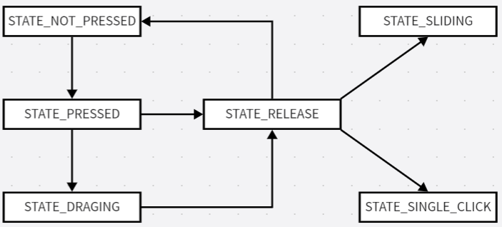

# project_EntertainmentTablet

## 效果展示

https://github.com/cjyiiiing/project_EntertainmentTablet/assets/55642261/a231d9e7-c062-4ef2-8a1c-e7b59469181b


## 概述
娱乐平板：<br />
1、开机动画<br />
2、锁屏界面<br />
3、绘图app（三种画笔大小、任意画笔颜色，退出前询问是否保存，支持bmp格式保存到相册图片的路径中）<br />
4、相册app（两种界面：总览界面 + 卷轴界面）

## 项目结构
- `data`：项目中用到的所有图像
- `driver`：驱动代码
- `include`：头文件
- `src`：源文件
- `pic`：README.md用到的图像数据

## 驱动部分
基于NXP官方提供的Linux内核代码

### 1 LCD驱动
根据所使用的LCD来修改设备树，修改完后重新编译设备树`make dtbs`
#### 1.1 LCD屏幕IO配置
包括24 根数据线、4 根控制线、背光 PWM 引脚的引脚复用和电气属性

#### 1.2 LCD 屏幕参数节点信息修改
包括一个像素占用几个 bit、总线宽度、像素时钟、X轴和Y轴的像素个数、hfp、hbp、hspw、vbp、vfp、vspw、hsync 数据线极性、vsync 数据线极性、de 数据线极性、clk 数据线极性等等

#### 1.3 LCD 屏幕背光节点信息
不用修改

### 2 多点电容触摸屏驱动
> 电容触摸屏驱动 = IIC设备驱动 + linux中断驱动框架 + input子系统<br/>
linux子系统下的多点电容触摸(MT)协议：<br/>
1、Type A：适用于触摸点不能被区分或者追踪，此类型的设备上报原始数据<br/>
2、Type B：适用于有硬件追踪并能区分触摸点的触摸设备，此类型设备通过 slot 更新某一个触摸点的信息

我所使用的是正点原子分辨率为800*480的4.3寸电容触摸屏，触摸驱动IC是GT9147

#### 2.1 修改设备树
1、在自己的设备树文件中添加GT9147用到的IO，包括一个复位IO、一个中断IO、I2C的SCL和SDA（查阅开发板原理图），并检查这些IO是否有被其他外设使用，若有则要屏蔽
```c
// 在iomuxc节点下添加中断IO
pinctrl_tsc: tscgrp {
        fsl,pins = <
                MX6UL_PAD_GPIO1_IO09__GPIO1_IO09           0x10b0
        >;
};
```
```c
// 由于触摸屏复位引脚使用的是 SNVS_TAMPER9，在iomuxc_snvs节点下添加复位IO
pinctrl_tsc_reset: tsc_reset {
        fsl,pins = <
                MX6ULL_PAD_SNVS_TAMPER9__GPIO5_IO09      0x10b0
        >;
};
```
```c
// 在iomuxc节点下添加SCL和SDA
pinctrl_i2c2: i2c2grp {
        fsl,pins = <
                MX6UL_PAD_UART5_TX_DATA__I2C2_SCL 0x4001b8b0
                MX6UL_PAD_UART5_RX_DATA__I2C2_SDA 0x4001b8b0
        >;
};
```
2、添加GT9147节点
查阅开发板原理图，GT9147挂载在I2C2下，因此向I2C2节点添加一个子节点用于描述GT9147：
```c
// 在i2c2节点下添加GT9147
gt9147:gt9147@14 {
        compatible = "goodix,gt9147", "goodix,gt9xx";
        reg = <0x14>;  // 查阅GT9147手册获得器件地址
        pinctrl-names = "default";
        pinctrl-0 = <&pinctrl_tsc
                                &pinctrl_tsc_reset>;  // 描述GT9147的复位 IO 和中断 IO 所使用的节点
        interrupt-parent = <&gpio1>;  // 描述中断 IO 对应的 GPIO 组
        interrupts = <9 0>;  // 描述中断 IO 对应的 GPIO 组
        reset-gpios = <&gpio5 9 GPIO_ACTIVE_LOW>;  // 描述中断 IO 对应的 GPIO 组
        interrupt-gpios = <&gpio1 9 GPIO_ACTIVE_LOW>;  // 描述中断 IO 对应的 GPIO 为 GPIO1_IO09
        status = "okay";
};
```
#### 2.2 编写多点电容触摸屏驱动
主要内容：

1、I2C驱动框架<br />
2、初始化触摸 IC、中断和 input 子系统
- 初始化触摸芯片，包括芯片的相关 IO，比如复位、中断等 IO 引脚，然后就是芯片本身的初始化，也就是配置触摸芯片的相关寄存器
- 初始化中断，在中断中向系统上报触摸点坐标信息，采用devm_request_threaded_irq（中断线程化，且申请到的资源可以由系统自动释放）
- 申请 input_dev
- 设置 input_dev 需要上报的事件
- 设置 EV_ABS 事件需要上报的内容
- 初始化多点电容触摸的 slots
- 注册前面申请到的 input_dev

3、在中断服务程序中上报读取到的坐标信息

具体实现：
driver/multitouch/gt9147.c

将驱动添加到内核中：将驱动文件放到内核源码目录的 drivers/input/touchscreen 文件夹下，并修改该文件夹下的Makefile文件，在最下面添加`obj-y += gt9147.o`，然后重新编译内核

## 应用实现
与app有关的：
- `app_boot`：开机动画
- `app_unlock`：锁屏界面，输入密码解锁
- `app_desktop`：桌面
- `app_draw`：绘图app，三种画笔大小、任意画笔颜色，退出前询问是否保存，支持bmp格式保存到相册图片的路径中
- `app_photo`：相册app，两种界面：总览界面 + 卷轴界面

其他：
- `touch_screen`：创建线程，运行触摸屏状态机（状态之间的转换如下图所示）
- `lcd`：显示bmp图像、显示字符串、绘制图形、保存bmp图像
- `DCLinkList`：双向循环链表，用于存储相册中的所有图像路径
- `fonts`：英文字模
- `debug.h`：用于调试时打开一些打印信息




## 参考
- https://gitee.com/gongxuan1116/gec6818-Entertainment-tablet
- 正点原子I.MX6U嵌入式Linux驱动开发指南